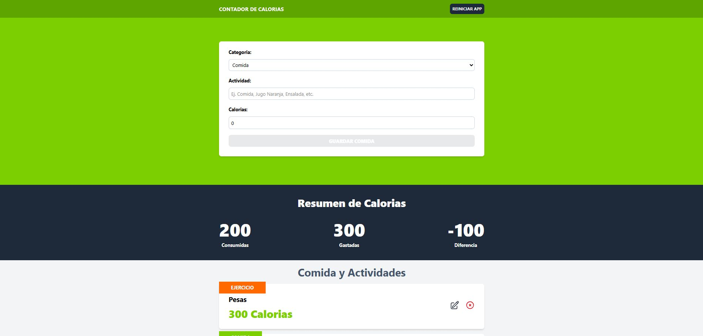

## 🥗 Contador de Calorías

Este proyecto permite llevar un registro de calorías ganadas y quemadas a través de comidas o ejercicios. Puedes agregar, editar o eliminar actividades, y el total de calorías se actualiza automáticamente según la categoría.

🔗 [Live Demo](https://contador-de-calorias05.netlify.app/)

### 🚀 Vista previa

 <!-- Cambia esta ruta si tienes una imagen del proyecto -->

---

### 🔧 Tecnologías utilizadas

---

### ⚙️ Funcionalidades

| Funcionalidad                  | Descripción                                                    |
|-------------------------------|----------------------------------------------------------------|
| ✅ Registro de comidas        | Añadir alimentos con calorías positivas                        |
| ✅ Registro de ejercicios     | Añadir ejercicios con calorías negativas                       |
| ✅ Cálculo automático         | Suma o resta calorías según la actividad                       |
| ✅ Estado global con reducer  | Manejo eficiente del estado con `useReducer`                   |
| ✅ Optimización con useMemo   | Previene cálculos innecesarios del total de calorías           |
| ✅ Persistencia local         | Guarda los datos en `localStorage` para mantener el historial  |

---

## 🥗 Calorie Counter

This project allows you to track calories consumed (food) and burned (exercise). You can add, update or remove entries. The total is automatically updated based on the type of activity.

🔗 [Live Demo](https://contador-de-calorias05.netlify.app/)

### 🚀 Preview

 <!-- Replace this path with an actual screenshot if available -->

---

### 🔧 Tech Stack

---

### ⚙️ Features

| Feature                       | Description                                                   |
|------------------------------|---------------------------------------------------------------|
| ✅ Add food                  | Add positive-calorie food entries                             |
| ✅ Add exercise              | Add negative-calorie exercise entries                         |
| ✅ Auto calculation          | Total updates according to type of entry                      |
| ✅ Global state with reducer| Uses `useReducer` to manage global state                      |
| ✅ Optimized with useMemo    | Prevents unnecessary total recalculations                     |
| ✅ Local persistence         | Saves data in `localStorage` for session persistence          |

---

